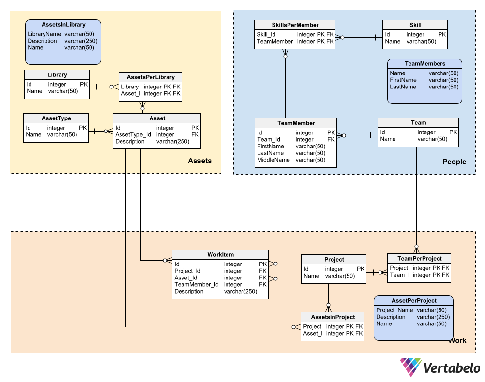

# My DB Schema


```{r setup, echo=FALSE, include=FALSE}
cat("\014") # Clear the console

library(pacman)
pacman::p_load(dbplyr,RSQLite,rmarkdown)

# Remove the SQLite file if exists or the following instruction will fail
dbfile <- "ca4-db.sqlite"
if (file.exists(dbfile)) {
  file.remove(dbfile)
}
#Create and connec the local database file
ca4_db <- dbConnect(RSQLite::SQLite(), dbfile)

```


```{r echo=FALSE}
# Create the tables
return <- dbExecute(ca4_db,"CREATE TABLE Asset (
    Id integer NOT NULL CONSTRAINT Asset_pk PRIMARY KEY,
    AssetType_Id integer NOT NULL,
    Description varchar(250) NOT NULL,
    CONSTRAINT Asset_AssetType FOREIGN KEY (AssetType_Id)
    REFERENCES AssetType (Id)
    )")

return <- dbExecute(ca4_db,"CREATE TABLE AssetType (
    Id integer NOT NULL CONSTRAINT AssetType_pk PRIMARY KEY,
    Name varchar(50) NOT NULL
)")

return <- dbExecute(ca4_db,"CREATE TABLE AssetsPerLibrary (
    Library_Id integer NOT NULL,
    Asset_Id integer NOT NULL,
    CONSTRAINT AssetsPerLibrary_pk PRIMARY KEY (Library_Id,Asset_Id),
    CONSTRAINT AssetsPerLibrary_Library FOREIGN KEY (Library_Id)
    REFERENCES Library (Id),
    CONSTRAINT AssetsPerLibrary_Asset FOREIGN KEY (Asset_Id)
    REFERENCES Asset (Id)
)")

return <- dbExecute(ca4_db,"CREATE TABLE AssetsinProject (
    Project_Id integer NOT NULL,
    Asset_Id integer NOT NULL,
    CONSTRAINT AssetsinProject_pk PRIMARY KEY (Project_Id,Asset_Id),
    CONSTRAINT AssetsinProject_Project FOREIGN KEY (Project_Id)
    REFERENCES Project (Id),
    CONSTRAINT AssetsinProject_Asset FOREIGN KEY (Asset_Id)
    REFERENCES Asset (Id)
)")

return <- dbExecute(ca4_db,"CREATE TABLE Library (
    Id integer NOT NULL CONSTRAINT Library_pk PRIMARY KEY,
    Name varchar(50) NOT NULL
)")

return <- dbExecute(ca4_db,"CREATE TABLE Project (
    Id integer NOT NULL CONSTRAINT Project_pk PRIMARY KEY,
    Name varchar(50) NOT NULL
)")

return <- dbExecute(ca4_db,"CREATE TABLE Skill (
    Id integer NOT NULL CONSTRAINT Skill_pk PRIMARY KEY,
    Name varchar(50) NOT NULL
)")

return <- dbExecute(ca4_db,"CREATE TABLE SkillsPerMember (
    Skill_Id integer NOT NULL,
    TeamMember_Id integer NOT NULL,
    CONSTRAINT SkillsPerMember_pk PRIMARY KEY (Skill_Id,TeamMember_Id),
    CONSTRAINT SkillsPerMember_Skill FOREIGN KEY (Skill_Id)
    REFERENCES Skill (Id),
    CONSTRAINT SkillsPerMember_TeamMember FOREIGN KEY (TeamMember_Id)
    REFERENCES TeamMember (Id)
)")

return <- dbExecute(ca4_db,"CREATE TABLE Team (
    Id integer NOT NULL CONSTRAINT Team_pk PRIMARY KEY,
    Name varchar(50) NOT NULL
)")

return <- dbExecute(ca4_db,"CREATE TABLE TeamMember (
    Id integer NOT NULL CONSTRAINT TeamMember_pk PRIMARY KEY,
    Team_Id integer NOT NULL,
    FirstName varchar(50) NOT NULL,
    LastName varchar(50) NOT NULL,
    MiddleName varchar(50) NOT NULL,
    CONSTRAINT TeamMember_Team FOREIGN KEY (Team_Id)
    REFERENCES Team (Id)
)")

return <- dbExecute(ca4_db,"CREATE TABLE TeamPerProject (
    Project_Id integer NOT NULL,
    Team_Id integer NOT NULL,
    CONSTRAINT TeamPerProject_pk PRIMARY KEY (Team_Id,Project_Id),
    CONSTRAINT TeamPerProject_Project FOREIGN KEY (Project_Id)
    REFERENCES Project (Id),
    CONSTRAINT TeamPerProject_Team FOREIGN KEY (Team_Id)
    REFERENCES Team (Id)
)")

return <- dbExecute(ca4_db,"CREATE TABLE WorkItem (
    Id integer NOT NULL CONSTRAINT WorkItem_pk PRIMARY KEY,
    Project_Id integer NOT NULL,
    Asset_Id integer NOT NULL,
    TeamMember_Id integer NOT NULL,
    Description varchar(250) NOT NULL,
    CONSTRAINT WorkItem_Project FOREIGN KEY (Project_Id)
    REFERENCES Project (Id),
    CONSTRAINT WorkItem_Asset FOREIGN KEY (Asset_Id)
    REFERENCES Asset (Id),
    CONSTRAINT WorkItem_TeamMember FOREIGN KEY (TeamMember_Id)
    REFERENCES TeamMember (Id)
)")

#return <- dbExecute(ca4_db,"")

#Create the views

return <- dbExecute(ca4_db,"CREATE VIEW TeamMembers AS
SELECT
    Team.Name,
    TeamMember.FirstName,
    TeamMember.LastName
FROM
 Team
INNER JOIN TeamMember ON 
 Team.Id = TeamMember.Team_Id
ORDER BY
 Team.Name,
    TeamMember.LastName;")

return <- dbExecute(ca4_db,"CREATE VIEW AssetPerProject AS
SELECT
 Project.Name AS Project_Name,
    Asset.Description,
    AssetType.Name
FROM
 Asset
INNER JOIN AssetType ON Asset.AssetType_Id = AssetType.Id
INNER JOIN AssetInProject ON Asset.Id = AssetsInProject.Asset_Id
INNER JOIN Project ON AssetsInProject.Id = Project.Id
ORDER BY
 Project.Name,
    Asset.Description;")

return <- dbExecute(ca4_db,"CREATE VIEW AssetsInLibrary AS
SELECT
 Library.Name AS LibraryName,
    Asset.Description,
    AssetType.Name
FROM
 Asset
INNER JOIN AssetType ON Asset.AssetType_Id = AssetType.Id
INNER JOIN AssetsPerLibrary ON Asset.Id = AssetsPerLibrary.Asset_Id
INNER JOIN Library ON AssetsPerLibrary.Library_Id = Library.Id;")

# Populate hte database

return <- dbExecute(ca4_db,"INSERT INTO AssetType
                              (Id, Name)
                              VALUES
                              (1, '3D Character')")

return <- dbExecute(ca4_db,"INSERT INTO AssetType
                              (Id, Name)
                              VALUES
                              (2, '3D Prop')")

return <- dbExecute(ca4_db,"INSERT INTO AssetType
                              (Id, Name)
                              VALUES
                              (3, 'Concept Art')")

return <- dbExecute(ca4_db,"INSERT INTO Asset
                              (Id, AssetType_Id, Description)
                              VALUES
                              (1, 'My Hero')")

return <- dbExecute(ca4_db,"INSERT INTO Asset
                              (Id, AssetType_Id, Description)
                              VALUES
                              (2, 'My Villian')")

return <- dbExecute(ca4_db,"INSERT INTO Asset
                              (Id, AssetType_Id, Description)
                              VALUES
                              (3, 'Big Sword')")

return <- dbExecute(ca4_db,"INSERT INTO Asset
                              (Id, AssetType_Id, Description)
                              VALUES
                              (4, 'Small Shield')")

return <- dbExecute(ca4_db,"INSERT INTO Asset
                              (Id, AssetType_Id, Description)
                              VALUES
                              (5, 'Light Armour')")

return <- dbExecute(ca4_db,"INSERT INTO Asset
                              (Id, AssetType_Id, Description)
                              VALUES
                              (6, 'Heavy Armour')")

return <- dbExecute(ca4_db,"INSERT INTO Library
                              (Id, Name)
                              VALUES
                              (1, '3D Props')")

return <- dbExecute(ca4_db,"INSERT INTO Library
                              (Id, Name)
                              VALUES
                              (2, '3D Characters')")

return <- dbExecute(ca4_db,"INSERT INTO Library
                              (Id, Name)
                              VALUES
                              (3, '3D Concepts')")

```

```{r echo=FALSE}
# Disconnect the databse
dbDisconnect(ca4_db)